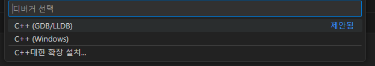

# 코딩 테스트용 C++ 핵심 정리

[코테용 C++ 핵심 정리 무료 강의 - 핵심적인 내용만 간추려서 빠르게 훑어볼 수 있는 3시간 완강가능! [홍정모 연구소]](https://www.youtube.com/watch?v=UqCZda8DLGc) 학습 노트

본 프로젝트는 '다른 학생들의 공부를 위해서 실습 문제의 정답이나 풀이를 공개하지' 않습니다.

예시 코드는 https://github.com/HongLabInc/HongLabCppSummary 에서 받을 수 있습니다. (본 프로젝트에서는 예시코드의 세팅을 따르지 않기 때문에 Ex01~Ex18 폴더만 붙여넣기함.)

## 목차
1. [C++ 환경 설정 window](#1-c-윈도우-설정-방법)
2. [컴퓨터 프로그램의 작동 과정](#2-컴퓨터-프로그램의-작동-과정)
3. [메모리 레이아웃](#3-메모리-레이아웃)

## 1. C++ 윈도우 설정 방법
[Visual Studio 공식 페이지](https://code.visualstudio.com/docs/languages/cpp#_example-install-mingwx64-on-windows) 를 참고하여 'MinGW'(C++ 컴파일러)를 설치한다. 


1. MSYS2를 통해 MinGW 컴파일러를 설치하기 위해 'this direct link to the MinGW installer'를 클릭해서 설치 파일을 다운로드 한다.
2. 설치 파일을 실행 후 설치를 진행한다.
3. 설치 완료 후 'MSYS2'를 실행한다.
4. `pacman -S --needed base-devel mingw-w64-ucrt-x86_64-toolchain`를 입력해서 'MinGW'를 설치한다.
   - 윈도우 환경 변수 path에 'C:\msys64\mingw64\bin'를 추가한다.
5. [Visual Studio Code 다운로드 페이지](https://code.visualstudio.com/download)에서 'VS Code'를 설치한다.
6. VS Code을 실행하고 C/C++ 확장 프로그램을 설치한다.
   - 
7. 'Ctrl + Shift + P'를 눌러 '명령 팔레트'를 실행한다.
8. 'C/C++: 구성 편집(UI)'를 입력해서 'IntelliSense 구성'에 진입한다.
9. 컴파일러 경로 및 IntelliSense 모드를 이미지를 참고하여 설정한다.
   - 
   - 컴파일러 경로 : `C:/msys64/ucrt64/bin/g++.exe`
   - IntelliSense 모드 : `windows-gcc-x64`

### HelloWorld 출력
1. C++ 확장자는 `.cpp`이다. `main.cpp` 파일을 생성하고 아래 코드를 작성한다.
   ```c++
   #include <iostream>
   
   using namespace std;
   
   int main()
   {
       cout << "Hello, Wolrd!" << endl;
   
       return 0;
   }
   ```
2. Ctrl + F5 를 눌러 프로그램을 실행시킨다.
3. 디버거를 'C++ (GDB/LLDB)'로 선택한다.
   - 
4. 'C/C++: g++.exe' 구성을 선택한다.
   - 
5. '터미널' 탭에서 출력된 'Hellom Wolrd!'를 확인한다.
   - 

### 설정 파일
'.vscode' 이름의 폴더 안에 json 파일이 VS Code에서 진행한 C++ 설정(컴파일러, 디버거 설정)을 담고 있다.

---

## 2. 컴퓨터 프로그램의 작동 과정

1. 빌드 과정을 통해 작성한 코드를 실행 파일(exe)로 만든다.
   - 빌드 전까지 코드는 하드디스크 내에 문서 파일로서 존재한다.
2. 실행 파일은 하드디스크에 저장되며, 프로그램이 된다.
3. 프로그램을 실행하면 운영 체제는 이 파일을 메모리(RAM)에 로드한다.
   - 프로그램의 코드와 필요한 데이터가 RAM에 적재된다.
4. CPU는 RAM에 적재된 프로그램의 명령어를 읽고 실행한다.
   - 이 과정에서 CPU는 프로그램의 바이트 코드를 처리하며, 필요한 연산을 수행하고 결과를 메모리에 저장하거나 출력 장치로 보낸다.

---

## 3. 메모리 레이아웃

- Text : 작성한 프로그램 자체가 Text 영역에 저장된다. 
  - CPU에게 명령을 내리는 구체적인 명령어가 저장되는 영역이다.
  - 읽기 전용이며, 프로그램 실행 중에는 변경되지 않는다.
- Data : 프로그램에서 명령어가 아닌 데이터에 해당하는 부분이 저장되는 영역이다.
  - 초기화된 데이터와 초기화되지 않은 데이터로 나뉠 수 있다.
- 나머지 영역은 Heap & Stack 으로 나누어서 상용한다.
  - Stack : 프로그램이 실행될 때 필요한 용량을 미리 잡아놓는 공간이라고 할 수 있다.
    - 함수 호출 시 생성되는 지역 변수, 매개변수, 반환 주소 등이 저장된다.
    - 이름이 'Stack'인 이유는 내부적으로 Stack이라는 자료구조를 사용하기 때문이다.
    - 사용할 수 있는 최대 용량이 미리 정해져 있다. (용량을 초과하면 'Stack Overflow'가 발생한다.)
  - Heap : 미리 크기를 알 수 없는 경우 Heap 영역에 저장된다.
    - 프로그래머가 직접 메모리를 할당하고 해제해야 한다. (C++에서는 new와 delete 사용)
    - 메모리 누수(Memory Leak)의 주요 원인이 될 수 있다.

---