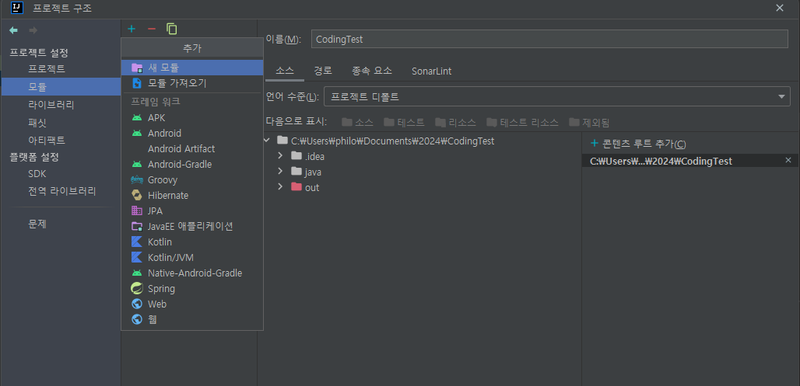
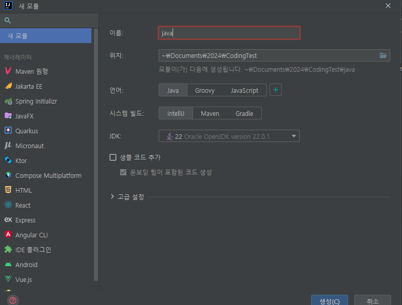
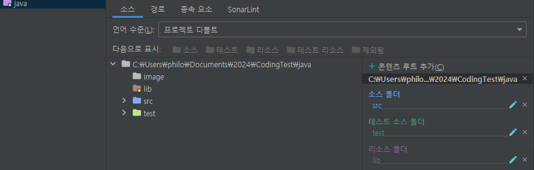
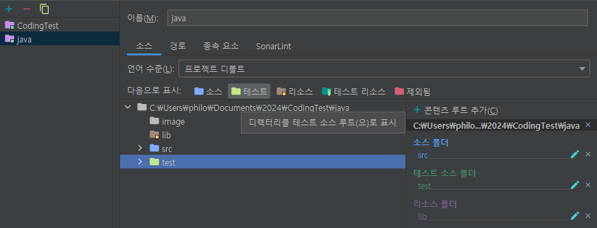
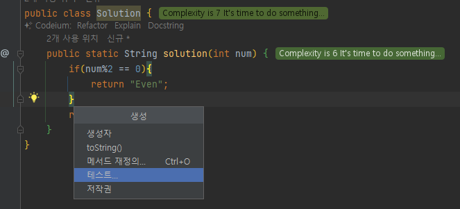
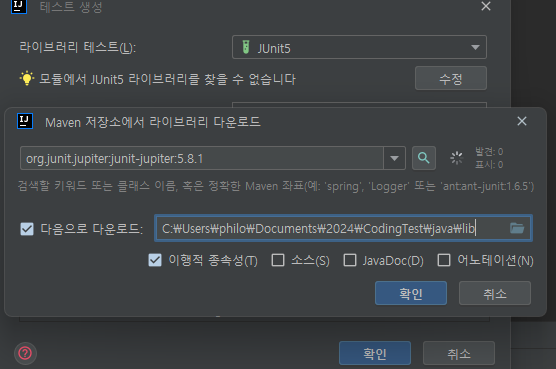

# JAVA 코딩테스트 연습 환경 설정
인텔리제이 IDE 기준으로 자바 코딩테스트 연습 환경을 JUnit5 TDD로 설정하는 내용을 담고 있습니다.

## 목차

## 1. 모듈 생성

- '프로젝트 구조(Ctrl + alt + shift + S)' 메뉴 진입
- '모듈' 탭에서 '+' 버튼 클릭해서 '새 모듈' 추가

- 이름 : 모듈명 입력
- 위치 : 루트 프로젝트 경로 선택
- 언어 : 'Java' 선택
- 시스템 빌드 : 'IntelliJ' 선택
- JDK : 최신 버전 or 코딩테스트 사이트에서 지원하는 버전 선택
- 샘플코드 추가 체크 해제

## 2. 모듈 디렉터리 구조 설정

- 모듈 생성 완료 후 'scr' 패키지 생성됨 (소스 폴더로 인식)
- 테스트 설정
  - src와 동일 경로 (java 경로)에 'test' 패키지 생성
  - '프로젝트 구조(Ctrl + alt + shift + S)' 메뉴 진입
  - 
  - 'test' 패키지 '테스트' 소스 루트로 지정

## 3. 테스트 케이스 작성

- src 경로에서 코드 작성 후 'shift + Insert'로 생성툴 진입
- '테스트' 선택

- "모듈에서 JUnit5 라이브러리 찾을 수 없습니다." 메시지 오른쪽 '수정' 버튼 클릭
- 라이브러리 경로 지정 후 'JUnit5' 라이브러리 설치
- 테스트 코드 생성 사용하여 테스트 코드 작성